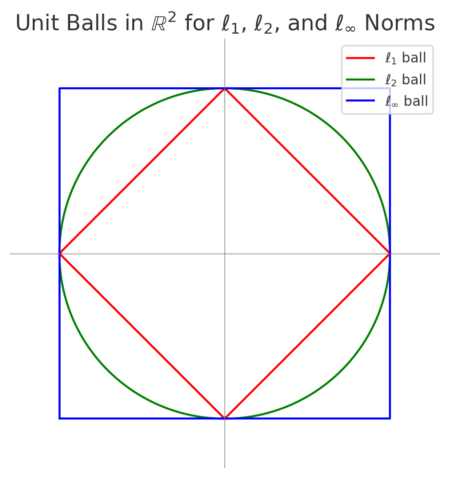

Optimization problems require measuring sizes of objects: the length of a step, the size of a residual, the magnitude of a gradient, or the distance between two points or functions. A norm is a function $\|\cdot\|: V \to [0,\infty)$ that assigns a length to each vector, satisfying three properties:  

1. **Positive definiteness:** $\|x\| \ge 0$ for all $x$, and $\|x\| = 0$ if and only if $x=0$.  
2. Homogeneity: $\|\alpha x\| = |\alpha|\,\|x\|$ for any scalar $\alpha$.  
3. **Triangle inequality:** $\|x+y\| \le \|x\| + \|y\|$ for all $x,y$. (This generalizes the fact that any side of a triangle is no longer than the sum of the other two.)

If the vector space has an inner product, the norm $\|x\| = \sqrt{\langle x,x\rangle}$ is called the Euclidean norm (or 2-norm). But many other norms exist, each defining a different geometry.  
Common examples on $\mathbb{R}^n$:  

- $\ell_2$ norm (Euclidean): $\|x\|_2 = \sqrt{\sum_i x_i^2}$, the usual length in space.  

- $\ell_1$ norm: $\|x\|_1 = \sum_i |x_i|$, measuring taxicab distance. In $\mathbb{R}^2$, its unit ball is a diamond.  

- $\ell_\infty$ norm: $\|x\|_\infty = \max_i |x_i|$, measuring the largest coordinate magnitude. Its unit ball in $\mathbb{R}^2$ is a square.  

- General $\ell_p$ norm: $\|x\|_p = \left(\sum_i |x_i|^p\right)^{1/p}$ for $p\ge1$. This interpolates between $\ell_1$ and $\ell_2$, and approaches $\ell_\infty$ as $p\to\infty$. All $\ell_p$ norms are convex and satisfy the norm axioms.  

Every norm induces a metric (distance) $d(x,y) = |x-y|$ on the space. Norms thus define the shape of “balls” (sets ${x: |x|\le \text{constant}}$) and how we measure closeness. The choice of norm can significantly influence an optimization algorithm’s behavior: it affects what steps are considered small, which directions are easy to move in, and how convergence is assessed.

{: style="float:right; margin-right:15px; width:400px;"}

**Unit-ball geometry:** The shape of the unit ball ${x: |x| \le 1}$ reveals how a norm treats different directions. For example, the $\ell_2$ unit ball in $\mathbb{R}^2$ is a perfect circle, treating all directions uniformly, whereas the $\ell_1$ unit ball is a diamond with corners along the axes, indicating that $\ell_1$ treats the coordinate axes as special (those are “cheaper” directions since the ball extends further along axes, touching them at $(\pm1,0)$ and $(0,\pm1)$). The $\ell_\infty$ unit ball is a square aligned with axes, suggesting it allows more combined motion in coordinates as long as no single coordinate exceeds the limit. These shapes are illustrated below: we see the red diamond ($\ell_1$), green circle ($\ell_2$), and blue square ($\ell_\infty$) in $\mathbb{R}^2$ . The geometry of the unit ball matters whenever we regularize or constrain solutions by a norm. For instance, using an $\ell_1$ norm ball as a constraint or regularizer encourages solutions on the corners (sparse solutions), while an $\ell_2$ ball encourages more evenly-distributed changes. An $\ell_\infty$ constraint limits the maximum absolute value of any component, leading to solutions that avoid any single large entry.

**Dual norms:** Every norm has an associated dual norm defined by:
 
$$\|y\|_* = \sup_{\|x\|\le1}\langle y,x\rangle$$  

the maximum pairing of $y$ with any unit vector in the original norm. Intuitively, if the primal norm defines what steps are allowed (the unit ball of $x$), the dual norm measures the “steepness” or influence of a linear direction $y$ against that allowed region. For $\ell_2$, the dual is itself ($\ell_2^* = \ell_2$) since the sphere is centrally symmetric. For $\ell_1$, the dual norm is $\ell_\infty$ (the maximum of components) — a gradient bounded in $\ell_\infty$ norm means it has a limited sum of effects on each coordinate, aligning with $\ell_1$ feasible steps. Conversely $\ell_\infty$’s dual is $\ell_1$. In general, the dual of $\ell_p$ is $\ell_q$ where $\frac1p + \frac1q = 1$. The Cauchy–Schwarz inequality is actually a special case: it tells us the dual of $\ell_2$ is $\ell_2$ by showing $\langle x,y\rangle \le |x|2|y|2$. Hölder’s inequality (Chapter 11) generalizes this to $p,q$ pairs. Dual norms appear naturally in optimality conditions: e.g. a subgradient inequality $\langle g, x-x^*\rangle \le 0$ can be bounded by $|g|* |x-x^*|$, so if $|g|$ is small, $x$ is nearly optimal. Also, the concept of duality in optimization often pairs a primal problem (in $x$) with a dual variable $y$ that lives in the dual norm space. For instance, gradient descent steps are often bounded by $|\nabla f|$ since we restrict $|x_{k+1}-x_k| \le \alpha$ in the primal norm.

**Norms in optimization algorithms:** Different norms define different algorithmic behaviors. For example, gradient descent typically uses the Euclidean norm for step sizes and convergence analysis, but coordinate descent methods implicitly use $\ell_\infty$ (since one coordinate move at a time is like a step in $\ell_\infty$ unit ball). Mirror descent methods use non-Euclidean norms and their duals to get better performance on certain problems (e.g. using $\ell_1$ norm for sparse problems). The norm also figures in complexity bounds: an algorithm’s convergence rate may depend on the diameter of the feasible set in the chosen norm, $D = \max_{\text{feasible}}|x - x^*|$. For instance, in subgradient methods, having a smaller $\ell_2$ diameter or $\ell_1$ diameter can improve bounds. Moreover, when constraints are given by norms (like $|x|_1 \le t$), projections and proximal operators with respect to that norm become subroutines in algorithms.

In summary, norms provide the metric backbone of optimization. They tell us how to measure progress ($|x_k - x^*|$), how to constrain solutions ($|x| \le R$), and how to bound errors. The choice of norm can induce sparsity, robustness, or other desired structure in solutions, and mastering norms and their geometry is key to understanding advanced optimization techniques.

 
