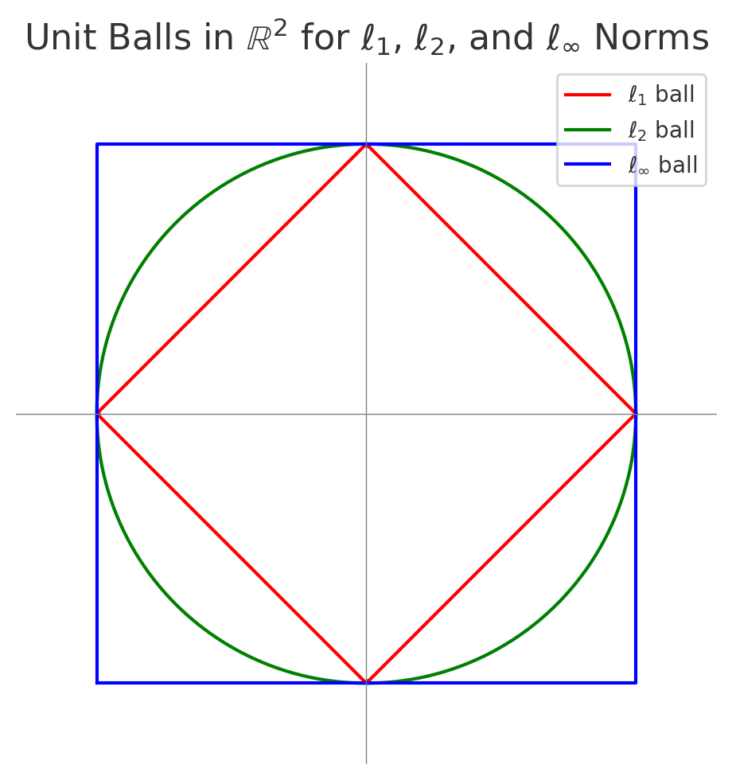

# Chapter 2: Linear Algebra Foundations

Linear algebra provides the geometric language of convex optimization. Many optimization problems in machine learning can be understood as asking how vectors, subspaces, and linear maps relate to one another. A simple example that shows this connection is linear least squares, where fitting a model $x$ to data $(A, b)$ takes the form:

$$
\min_x \ \|A x - b\|_2^2.
$$

Later in this chapter, we will see that this objective finds the point in the column space of $A$ that is closest to $b$. Concepts such as column space, null space, orthogonality, rank, and conditioning determine not only whether a solution exists, but also how fast optimization algorithms converge.

This chapter develops the linear-algebra tools that appear throughout convex optimization and machine learning. We focus on geometric ideas — projections, subspaces, orthogonality, eigenvalues, singular values, and norms — because these ideas directly shape how optimization behaves. Readers familiar with basic matrix operations will find that many optimization concepts become much simpler when viewed through the right geometric lens.

## 2.1 Vector spaces, subspaces, and affine sets

A vector space over $\mathbb{R}$ is a set of vectors that can be added and scaled without leaving the set. The familiar example is $\mathbb{R}^n$, where operations like $\alpha x + \beta y$ keep us within the same space.

Within a vector space, some subsets behave particularly nicely. A subspace is a subset that is itself a vector space: it is closed under addition, closed under scalar multiplication, and contains the zero vector. Geometrically, subspaces are “flat” objects that always pass through the origin, such as lines or planes in $\mathbb{R}^3$. 

Affine sets extend this idea by allowing a shift away from the origin. A set $A$ is affine if it contains the entire line passing through any two of its points. Equivalently, for any $x,y \in A$ and any $\theta \in \mathbb{R}$,  $\theta x + (1 - \theta) y \in A.$ That is, the entire line passing through any two points in $A$ lies within $A$. By contrast, a convex set only requires this property for $\theta \in [0,1]$, meaning only the line segment between $x$ and $y$ must lie within the set. 

Affine sets look like translated subspaces: lines or planes that do not need to pass through the origin. Every affine set can be written as: $A = x_0 + S = \{\, x_0 + s : s \in S \,\},$ where $S$ is a subspace and $x_0$ is any point in the set. This representation is extremely useful in optimization. If $Ax = b$ is a linear constraint, then its solution set is an affine set. A single particular solution $x_0$ gives one point satisfying the constraint, and the entire solution set is obtained by adding the null space of $A$. Thus, optimization under linear constraints means searching over an affine set determined by the constraint structure.

Finally, affine transformations play a central role in both machine learning and optimization. A mapping of the form

Affine Transformations: An affine transformation (or affine map) is a function $f : V \to W$ that can be written as $f(x) = A x + b,$ where $A$ is a linear map and $b$ is a fixed vector. Affine transformations preserve both affinity and convexity:
if $C$ is convex, then $A C + b$ is also convex.
is called an affine transformation. It represents a linear transformation followed by a translation. Affine transformations preserve the structure of affine sets and convex sets, meaning that if a feasible region is convex or affine, applying an affine transformation does not destroy that property. This matters for optimization because many models and algorithms implicitly perform affine transformations for example, when reparameterizing variables, scaling features, or mapping between coordinate systems. Convexity is preserved under these operations, so the essential geometry of the problem remains intact.

In summary, vector spaces describe the ambient space in which optimization algorithms move, subspaces capture structural or constraint-related directions, and affine sets model the geometric shapes defined by linear constraints. These three ideas form the basic geometric toolkit for understanding optimization problems and will reappear repeatedly throughout the rest of the book.

 
## 2.2 Linear combinations, span, basis, dimension
Much of linear algebra revolves around understanding how vectors can be combined to generate new vectors. This idea is essential in optimization because gradients, search directions, feasible directions, and model predictions are often built from linear combinations of simpler components.

Given vectors $v_1,\dots,v_k$, any vector of the form$
\alpha_1 v_1 + \cdots + \alpha_k v_k$ is a linear combination. The set of all linear combinations is called the span:
$$
\mathrm{span}\{v_1,\dots,v_k\} = \left\{ \sum_{i=1}^k \alpha_i v_i : \alpha_i \in \mathbb{R} \right\}.
$$
The span describes the collection of directions that can be reached from these vectors and therefore determines what portion of the ambient space they can represent. 

The concept of linear independence formalizes when a set of vectors contains no redundancy. A set of vectors is linearly independent if none of them can be written as a linear combination of the others. If a set is linearly dependent, at least one vector adds no new direction. 

A basis of a space $V$ is a linearly independent set whose span equals $V$. The number of basis vectors is the dimension $\dim(V)$.

Rank and nullity facts:

- The column space of $A$ is the span of its columns. Its dimension is $\mathrm{rank}(A)$.
- The nullspace of $A$ is $\{ x : Ax = 0 \}$.
- The rank-nullity theorem states: $\mathrm{rank}(A) + \mathrm{nullity}(A) = n,$ where $n$ is the number of columns of $A$.

> Column Space: The column space of a matrix \( A \), denoted \( C(A) \), is the set of all possible output vectors \( b \) that can be written as \( Ax \) for some \( x \). In other words, it contains all vectors that the matrix can “reach” through linear combinations of its columns. The question “Does the system \( Ax = b \) have a solution?” is equivalent to asking whether \( b \in C(A) \). If \( b \) lies in the column space, a solution exists; otherwise, it does not.

> Null Space: The null space (or kernel) of \( A \), denoted \( N(A) \), is the set of all input vectors \( x \) that are mapped to zero:  \( N(A) = \{ x : Ax = 0 \} \). It answers a different question: *If a solution to \( Ax = b \) exists, is it unique?* If the null space contains only the zero vector (\( \mathrm{nullity}(A) = 0 \)), the solution is unique. But if \( N(A) \) contains nonzero vectors, there are infinitely many distinct solutions that yield the same output.

> Multicollinearity: When one feature in the data matrix \( A \) is a linear combination of others for example, \( \text{feature}_3 = 2 \times \text{feature}_1 + \text{feature}_2 \)—the columns of \( A \) become linearly dependent. This creates a nonzero vector in the null space of \( A \), meaning multiple weight vectors \( x \) can produce the same predictions. The model is then *unidentifiable* (Underdetermined – the number of unknowns (parameters) exceeds the number of independent equations (information)), and \( A^\top A \) becomes singular (non-invertible). Regularization methods such as Ridge or Lasso regression are used to resolve this ambiguity by selecting one stable, well-behaved solution.

>> Regularization introduces an additional constraint or penalty that selects a *single, stable* solution from among the infinite possibilities.

>> - Ridge regression (L2 regularization) adds a penalty on the norm of $x$:
  $$
  \min_x \|A x - b\|_2^2 + \lambda \|x\|_2^2,
  $$
  which modifies the normal equations to
  $$
  (A^\top A + \lambda I)x = A^\top b.
  $$
  The added term $\lambda I$ ensures invertibility and numerical stability.

>> - Lasso regression (L1 regularization) instead penalizes $\|x\|_1$, promoting sparsity by driving some coefficients exactly to zero.

>> Thus, regularization resolves ambiguity by imposing structure or preference on the solution favoring smaller or sparser coefficient vectors—and making the regression problem well-posed even when $A$ is rank-deficient.

> Feasible Directions: In a constrained optimization problem of the form \( Ax = b \), the null space of \( A \) characterizes the directions along which one can move without violating the constraints. If \( d \in N(A) \), then moving from a feasible point \( x \) to \( x + d \) preserves feasibility, since  \( A(x + d) = Ax + Ad = b \). Thus, the null space defines the *space of free movement* directions in which optimization algorithms can explore solutions while remaining within the constraint surface.

> Row Space: The row space of \( A \), denoted \( R(A) \), is the span of the rows of \( A \) (viewed as vectors). It represents all possible linear combinations of the rows and has the same dimension as the column space, equal to \( \mathrm{rank}(A) \). The row space is orthogonal to the null space of \( A \):  \( R(A) \perp N(A) \).  In optimization, the row space corresponds to the set of active constraints or the directions along which changes in \( x \) affect the constraints.

> Left Null Space: The left null space, denoted \( N(A^\top) \), is the set of all vectors \( y \) such that \( A^\top y = 0 \). These vectors are orthogonal to the columns of \( A \), and therefore orthogonal to the column space itself. In least squares problems, \( N(A^\top) \) represents residual directions—components of \( b \) that cannot be explained by the model \( Ax = b \).

> Projection Interpretation (Least Squares):  When \( Ax = b \) has no exact solution (as in overdetermined systems), the least squares solution finds \( x \) such that \( Ax \) is the projection of \( b \) onto the column space of \( A \):  
> \[
> x^* = (A^\top A)^{-1} A^\top b,
> \]
> and the residual  
> \[
> r = b - Ax^*
> \]
> lies in the left null space \( N(A^\top) \).  
> This provides a geometric view: the solution projects \( b \) onto the closest point in the subspace that \( A \) can reach.

> Rank–Nullity Relationship: The rank of \( A \) is the dimension of both its column and row spaces, and the nullity is the dimension of its null space. Together they satisfy the Rank–Nullity Theorem:
> \[
> \mathrm{rank}(A) + \mathrm{nullity}(A) = n,
> \]
> where \( n \) is the number of columns of \( A \). This theorem reflects the balance between the number of independent constraints and the number of degrees of freedom in \( x \).

> Geometric Interpretation:  

> - The column space represents all *reachable outputs*.  
> - The null space represents all *indistinguishable inputs* that map to zero.  
> - The row space represents all *independent constraints* imposed by \( A \).  
> - The left null space captures *inconsistencies* or residual directions that cannot be explained by the model.  
>  
> Together, these four subspaces define the complete geometry of the linear map \( A: \mathbb{R}^n \to \mathbb{R}^m \).

## 2.3 Inner products and orthogonality
Inner products provide the geometric structure that underlies most optimization algorithms. They allow us to define lengths, angles, projections, gradients, and orthogonality—concepts that appear repeatedly in convex optimization and machine learning.

An inner product on $\mathbb{R}^n$ is a map $\langle \cdot,\cdot\rangle : \mathbb{R}^n \times \mathbb{R}^n \to \mathbb{R}$ such that for all $x,y,z$ and all scalars $\alpha$:

1. $\langle x,y \rangle = \langle y,x\rangle$ (symmetry),
2. $\langle x+y,z \rangle = \langle x,z \rangle + \langle y,z\rangle$ (linearity in first argument),
3. $\langle \alpha x, y\rangle = \alpha \langle x, y\rangle$,
4. $\langle x, x\rangle \ge 0$ with equality iff $x=0$ (positive definiteness).

The inner product induces:

- length (norm): $\|x\|_2 = \sqrt{\langle x,x\rangle}$,
- angle: $
\cos \theta = \frac{\langle x,y\rangle}{\|x\|\|y\|}~.
$

Two vectors are orthogonal if $\langle x,y\rangle = 0$. A set of vectors $\{v_i\}$ is orthonormal if each $\|v_i\| = 1$ and $\langle v_i, v_j\rangle = 0$ for $i\ne j$.

> More generally, an inner product endows $V$ with a geometric structure, turning it into an inner product space (and if complete, a Hilbert space). Inner products allow us to talk about orthogonality (perpendicular vectors) and orthogonal projections, and to define the all-important concept of a gradient in optimization. 

> Geometry from the inner product: An inner product induces a norm $\|x\| = \sqrt{\langle x,x \rangle}$ and a notion of distance $d(x,y) = \|x-y\|$. It also defines angles: $\langle x,y \rangle = 0$ means $x$ and $y$ are orthogonal. Thus, inner products generalize the geometric concepts of lengths and angles to abstract vector spaces. Many results in Euclidean geometry (like the Pythagorean theorem and law of cosines) hold in any inner product space. For example, the parallelogram law holds: $\|x+y\|^2 + \|x-y\|^2 = 2\|x\|^2 + 2\|y\|^2$.  

The Cauchy–Schwarz inequality: For any $x,y \in \mathbb{R}^n$:
$$
|\langle x,y\rangle| \le \|x\|\|y\|~,
$$
with equality iff $x$ and $y$ are linearly dependent Geometrically, it means the absolute inner product is maximized when $x$ and $y$ point in the same or opposite direction. 

Examples of inner products:

- Standard (Euclidean) inner product: $\langle x,y\rangle = x^\top y = \sum_i x_i y_i$. This underlies most optimization algorithms on $\mathbb{R}^n$, where $\nabla f(x)$ is defined via this inner product (so that $\langle \nabla f(x), h\rangle$ gives the directional derivative in direction $h$).  

- Weighted inner product: $\langle x,y\rangle_W = x^\top W y$ for some symmetric positive-definite matrix $W$. Here $\|x\|_W = \sqrt{x^\top W x}$ is a weighted length. Such inner products appear in preconditioning: by choosing $W$ cleverly, one can measure distances in a way that accounts for scaling in the problem (e.g. the Mahalanobis distance uses $W = \Sigma^{-1}$ for covariance $\Sigma$).  

- Function space inner product: $\langle f, g \rangle = \int_a^b f(t)\,g(t)\,dt$. This turns the space of square-integrable functions on $[a,b]$ into an inner product space (a Hilbert space, $L^2[a,b]$). In machine learning, this is the basis for kernel Hilbert spaces, where one defines an inner product between functions to lift optimization into infinite-dimensional feature spaces.  

> Any vector space with an inner product has an orthonormal basis (via the Gram–Schmidt process). Gram–Schmidt is fundamental in numerical algorithms to orthogonalize vectors and is used to derive the QR decomposition: any full-rank matrix $A \in \mathbb{R}^{m\times n}$ can be factored as $A = QR$ where $Q$ has orthonormal columns and $R$ is upper triangular. This factorization is widely used in least squares and optimization because it provides a stable way to solve $Ax=b$ and to analyze subspaces. For example, for an overdetermined system ($m>n$ i.e. more equations than unknowns), $Ax=b$ has a least-squares solution $x = R^{-1}(Q^\top b)$, and for underdetermined ($m<n$), $Ax=b$ has infinitely many solutions, among which one often chooses the minimal-norm solution using the orthonormal basis of the range. 

Applications in optimization: Inner product geometry is indispensable in convex optimization.  

- Gradients: The gradient $\nabla f(x)$ is defined as the vector satisfying $f(x+h)\approx f(x) + \langle \nabla f(x), h\rangle$. Thus the inner product induces the notion of steepest ascent/descent direction (steepest descent is in direction $-\nabla f(x)$ because it minimizes the inner product with the gradient). If we changed the inner product (using a matrix $W$), the notion of gradient would change accordingly (this idea is used in natural gradient methods).  

- Orthogonal projections: Many algorithms require projecting onto a constraint set. For linear constraints $Ax=b$ (an affine set), the projection formula uses the inner product to find the closest point in the affine set. Projections also underpin least squares problems (solution is projection of $b$ onto $\mathrm{range}(A)$) and quadratic programs (where each iteration might involve a projection).  

- Orthonormal representations: Orthonormal bases (like principal components) simplify optimization by diagonalizing quadratic forms or separating variables. For instance, in PCA we use an orthonormal basis (eigenvectors) to reduce dimensionality. In iterative algorithms, working in an orthonormal basis aligned with the problem (e.g. preconditioning) can accelerate convergence.  

- Conditioning and Gram matrix: The inner product concept leads to the Gram matrix $G_{ij} = \langle x_i, x_j\rangle$ for a set of vectors. In machine learning, the Gram matrix (or kernel matrix) encodes similarity of features and appears in the normal equations for least squares: $X^\top X$ is a Gram matrix whose eigenvalues tell us about problem conditioning. A well-conditioned Gram matrix (no tiny eigenvalues) means the problem is nicely scaled for gradient descent, whereas ill-conditioning (some nearly zero eigenvalues) means there are directions in weight space that are very flat, slowing convergence. Techniques like feature scaling or adding regularization (ridge regression) improve the Gram matrix’s condition number and thus algorithm performance.

## 2.4 Norms and distances

A function $\|\cdot\|: \mathbb{R}^n \to \mathbb{R}$ is a norm if for all $x,y$ and scalar $\alpha$:

1. $\|x\| \ge 0$ and $\|x\| = 0 \iff x=0$,
2. $\|\alpha x\| = |\alpha|\|x\|$ (absolute homogeneity),
3. $\|x+y\| \le \|x\| + \|y\|$ (triangle inequality).

If the vector space has an inner product, the norm $\|x\| = \sqrt{\langle x,x\rangle}$ is called the Euclidean norm (or 2-norm). But many other norms exist, each defining a different geometry.  
Common examples on $\mathbb{R}^n$:  

- $\ell_2$ norm (Euclidean): $\|x\|_2 = \sqrt{\sum_i x_i^2}$, the usual length in space.  

- $\ell_1$ norm: $\|x\|_1 = \sum_i |x_i|$, measuring taxicab distance. In $\mathbb{R}^2$, its unit ball is a diamond.  

- $\ell_\infty$ norm: $\|x\|_\infty = \max_i |x_i|$, measuring the largest coordinate magnitude. Its unit ball in $\mathbb{R}^2$ is a square.  

- General $\ell_p$ norm: $\|x\|_p = \left(\sum_i |x_i|^p\right)^{1/p}$ for $p\ge1$. This interpolates between $\ell_1$ and $\ell_2$, and approaches $\ell_\infty$ as $p\to\infty$. All $\ell_p$ norms are convex and satisfy the norm axioms.  

Every norm induces a metric (distance) $d(x,y) = |x-y|$ on the space. Norms thus define the shape of “balls” (sets ${x: |x|\le \text{constant}}$) and how we measure closeness. The choice of norm can significantly influence an optimization algorithm’s behavior: it affects what steps are considered small, which directions are easy to move in, and how convergence is assessed.

{: style="float:right; margin-right:15px; width:400px;"}

Unit-ball geometry: The shape of the unit ball ${x: |x| \le 1}$ reveals how a norm treats different directions. For example, the $\ell_2$ unit ball in $\mathbb{R}^2$ is a perfect circle, treating all directions uniformly, whereas the $\ell_1$ unit ball is a diamond with corners along the axes, indicating that $\ell_1$ treats the coordinate axes as special (those are “cheaper” directions since the ball extends further along axes, touching them at $(\pm1,0)$ and $(0,\pm1)$). The $\ell_\infty$ unit ball is a square aligned with axes, suggesting it allows more combined motion in coordinates as long as no single coordinate exceeds the limit. These shapes are illustrated below: we see the red diamond ($\ell_1$), green circle ($\ell_2$), and blue square ($\ell_\infty$) in $\mathbb{R}^2$ . The geometry of the unit ball matters whenever we regularize or constrain solutions by a norm. For instance, using an $\ell_1$ norm ball as a constraint or regularizer encourages solutions on the corners (sparse solutions), while an $\ell_2$ ball encourages more evenly-distributed changes. An $\ell_\infty$ constraint limits the maximum absolute value of any component, leading to solutions that avoid any single large entry.

Dual norms: Each norm $\|\cdot\|$ has a dual norm $\|\cdot\|_*$ defined by
$$
\|y\|_* = \sup_{\|x\|\le 1} x^\top y~.
$$
For example, the dual of $\ell_1$ is $\ell_\infty$, and the dual of $\ell_2$ is itself.

> Imagine the vector $x$ lives inside the original norm ball ($\|x\| \le 1$). The term $x^\top y$ is the dot product, which measures the alignment between $x$ and $y$. The dual norm $\|y\|_*$ is the maximum possible value you can get by taking the dot product of $y$ with any vector $x$ that fits inside the original norm ball.If the dual norm $\|y\|_*$ is large, it means $y$ is strongly aligned with a direction $x$ that is "small" (size $\le 1$) according to the original norm.If the dual norm is small, $y$ must be poorly aligned with all vectors $x$ in the ball.

Norms in optimization algorithms: Different norms define different algorithmic behaviors. For example, gradient descent typically uses the Euclidean norm for step sizes and convergence analysis, but coordinate descent methods implicitly use $\ell_\infty$ (since one coordinate move at a time is like a step in $\ell_\infty$ unit ball). Mirror descent methods use non-Euclidean norms and their duals to get better performance on certain problems (e.g. using $\ell_1$ norm for sparse problems). The norm also figures in complexity bounds: an algorithm’s convergence rate may depend on the diameter of the feasible set in the chosen norm, $D = \max_{\text{feasible}}|x - x^*|$. For instance, in subgradient methods, having a smaller $\ell_2$ diameter or $\ell_1$ diameter can improve bounds. Moreover, when constraints are given by norms (like $|x|_1 \le t$), projections and proximal operators with respect to that norm become subroutines in algorithms.

In summary, norms provide the metric backbone of optimization. They tell us how to measure progress ($|x_k - x^*|$), how to constrain solutions ($|x| \le R$), and how to bound errors. The choice of norm can induce sparsity, robustness, or other desired structure in solutions, and mastering norms and their geometry is key to understanding advanced optimization techniques.

## 2.5 Eigenvalues, eigenvectors, and positive semidefinite matrices

If $A \in \mathbb{R}^{n\times n}$ is linear, a nonzero $v$ is an eigenvector with eigenvalue $\lambda$ if

$$
Av = \lambda v~.
$$

When $A$ is symmetric ($A = A^\top$), it has:

- real eigenvalues,
- an orthonormal eigenbasis,
- a spectral decomposition

$$
A = Q \Lambda Q^\top,
$$
where $Q$ is orthonormal and $\Lambda$ is diagonal.

This is the spectral decomposition. Geometrically, a symmetric matrix acts as a scaling along $n$ orthogonal principal directions (its eigenvectors), stretching or flipping by factors given by $\lambda_i$.

> When dealing specifically with square matrices and quadratic forms (like Hessians of twice-differentiable functions), eigenvalues become central. They describe how a symmetric matrix scales vectors in different directions. Many convex optimization conditions involve requiring a matrix (Hessian or constraint curvature matrix) to be positive semidefinite, which is an eigenvalue condition.

> In optimization, the Hessian matrix of a multivariate function $f(x)$ is symmetric. Its eigenvalues $\lambda_i(\nabla^2 f(x))$ tell us the curvature along principal axes. If all eigenvalues are positive at a point, the function curves up in all directions (a local minimum if gradient is zero); if any eigenvalue is negative, there’s a direction of negative curvature (a saddle or maximum). So checking eigenvalues of Hessian is a way to test convexity/concavity locally.

Positive semidefinite matrices: A symmetric matrix $Q$ is positive semidefinite (PSD) if

$$
x^\top Q x \ge 0 \quad \text{for all } x~.
$$

If $x^\top Q x > 0$ for all $x\ne 0$, then $Q$ is positive definite (PD).

Why this matters: if $f(x) = \tfrac{1}{2} x^\top Q x + c^\top x + d$, then

$$
\nabla^2 f(x) = Q~.
$$

So $f$ is convex iff $Q$ is PSD. Quadratic objectives with PSD Hessians are convex; with indefinite Hessians, they are not. This is the algebraic test for convexity of quadratic forms.

> Implications of definiteness: If $A \succ 0$, the quadratic function $x^T A x$ is strictly convex and has a unique minimizer at $x=0$. If $A \succeq 0$, $x^T A x$ is convex but could be flat in some directions (if some $\lambda_i = 0$, those eigenvectors lie in the nullspace and the form is constant along them). In optimization, PD Hessian $\nabla^2 f(x) \succ 0$ means $f$ has a unique local (and global, if domain convex) minimum at that $x$ (since the second-order condition for optimality is satisfied strictly). PD constraint matrices in quadratic programs ensure nice properties like Slater’s condition for strong duality.

> Condition number and convergence: For iterative methods on convex quadratics $f(x) = \frac{1}{2}x^T Q x - b^T x$, the eigenvalues of $Q$ dictate convergence speed. Gradient descent’s error after $k$ steps satisfies roughly $|x_k - x^*| \le (\frac{\lambda_{\max}-\lambda_{\min}}{\lambda_{\max}+\lambda_{\min}})^k |x_0 - x^*|$ (for normalized step). So the ratio $\frac{\lambda_{\max}}{\lambda_{\min}} = \kappa(Q)$ appears: closer to 1 (well-conditioned) means rapid convergence; large ratio (ill-conditioned) means slow, zigzagging progress. Newton’s method uses Hessian inverse, effectively rescaling by eigenvalues to 1, so its performance is invariant to $\kappa$ (locally). This explains why second-order methods shine on ill-conditioned problems: they “whiten” the curvature by dividing by eigenvalues.

> Optimization interpretation of eigenvectors: The eigenvectors of $\nabla^2 f(x^*)$ at optimum indicate principal axes of the local quadratic approximation. Directions with small eigenvalues are flat directions where the function changes slowly (possibly requiring LARGE steps unless Newton’s method is used). Directions with large eigenvalues are steep, potentially requiring small step sizes to maintain stability if using gradient descent. Preconditioning or change of variables often aims to transform the problem so that in new coordinates the Hessian is closer to the identity (all eigenvalues ~1). 

## 2.6 Orthogonal projections and least squares

Let $S$ be a subspace of $\mathbb{R}^n$. The orthogonal projection of a vector $b$ onto $S$ is the unique vector $p \in S$ minimising $\|b - p\|_2$. Geometrically, $p$ is the closest point in $S$ to $b$. If $S = \mathrm{span}\{a_1,\dots,a_k\}$ and $A = [a_1~\cdots~a_k]$, then projecting $b$ onto $S$ is equivalent to solving the least-squares problem

$$
\min_x \|Ax - b\|_2^2~.
$$

The solution $x^*$ satisfies the normal equations

$$
A^\top A x^* = A^\top b~.
$$

This is our first real convex optimisation problem:

- the objective $\|Ax-b\|_2^2$ is convex,
- there are no constraints,
- we can solve it in closed form.

## 2.7 Operator norms, singular values, and spectral structure

Many aspects of optimization depend on how a matrix transforms vectors: how much it stretches them, in which directions it amplifies or shrinks signals, and how sensitive it is to perturbations. Operator norms and singular values provide the tools to quantify these behaviors.

### Operator norms

Given a matrix $A : \mathbb{R}^n \to \mathbb{R}^m$ and norms $\|\cdot\|_p$ on $\mathbb{R}^n$ and $\|\cdot\|_q$ on $\mathbb{R}^m$, the induced operator norm is defined as
\[
\|A\|_{p \to q}
=
\sup_{x \neq 0}
\frac{\|A x\|_q}{\|x\|_p}
=
\sup_{\|x\|_p \le 1} \|A x\|_q.
\]
This quantity measures the largest amount by which $A$ can magnify a vector when measured with the chosen norms. Several important special cases are widely used:

- $\|A\|_{2 \to 2}$, the spectral norm, equals the largest singular value of $A$.
- $\|A\|_{1 \to 1}$ is the maximum absolute column sum.
- $\|A\|_{\infty \to \infty}$ is the maximum absolute row sum.

In optimization, operator norms play a central role in determining stability. For example, gradient descent on the quadratic function  
\[
f(x) = \tfrac{1}{2} x^\top Q x - b^\top x
\]
converges for step sizes $\alpha < 2 / \|Q\|_2$. This shows that controlling the operator norm of the Hessian—or a Lipschitz constant of the gradient—directly governs how aggressively an algorithm can move.

### Singular Value Decomposition (SVD)

Any matrix $A \in \mathbb{R}^{m \times n}$ admits a factorization
\[
A = U \Sigma V^\top,
\]
where $U$ and $V$ are orthogonal matrices and $\Sigma$ is diagonal with nonnegative entries $\sigma_1 \ge \sigma_2 \ge \cdots$. The $\sigma_i$ are the singular values of $A$.

Geometrically, the SVD shows how $A$ transforms the unit ball into an ellipsoid. The columns of $V$ give the principal input directions, the singular values are the lengths of the ellipsoid’s axes, and the columns of $U$ give the output directions. The largest singular value $\sigma_{\max}$ equals the spectral norm $\|A\|_2$, while the smallest $\sigma_{\min}$ describes the least expansion (or exact flattening if $\sigma_{\min} = 0$).

SVD is a powerful diagnostic tool in optimization. The ratio
\[
\kappa(A) = \frac{\sigma_{\max}}{\sigma_{\min}}
\]
is the condition number of $A$. A large condition number implies that the map stretches some directions much more than others, leading to slow or unstable convergence in gradient methods. A small condition number means $A$ behaves more like a uniform scaling, which is ideal for optimization.

### Low-rank structure

The rank of $A$ is the number of nonzero singular values. When $A$ has low rank, it effectively acts on a lower-dimensional subspace. This structure can be exploited in optimization: low-rank matrices enable dimensionality reduction, fast matrix-vector products, and compact representations. In machine learning, truncated SVD is used for PCA, feature compression, and approximating large linear operators.

Low-rank structure is also a modeling target. Convex formulations such as nuclear-norm minimization encourage solutions whose matrices have small rank, reflecting latent low-dimensional structure in data.

### Operator norms and optimization algorithms

Operator norms help determine step sizes, convergence rates, and preconditioning strategies. For a general smooth convex function, the Lipschitz constant of its gradient often corresponds to a spectral norm of a Hessian or Jacobian, and this constant controls the safe step size for gradient descent. Preconditioning modifies the geometry of the problem—changing the inner product or scaling the variables—in order to reduce the effective operator norm and improve conditioning.

These spectral considerations appear in both first-order and second-order methods. Newton’s method, for example, implicitly rescales the space using the inverse Hessian, which equalizes curvature by transforming eigenvalues toward 1. This explains its rapid local convergence when the Hessian is well behaved.

### Summary

- The operator norm measures the maximum stretching effect of a matrix.
- Singular values give a complete geometric description of this stretching.
- The condition number captures how unevenly the matrix acts in different directions.
- Low-rank structure reveals underlying dimension and enables efficient computation.
- All of these properties strongly influence the behavior and design of optimization algorithms.

Understanding operator norms and singular values provides valuable insight into when optimization problems are well conditioned, how algorithms will behave, and how to modify a problem to improve performance.
